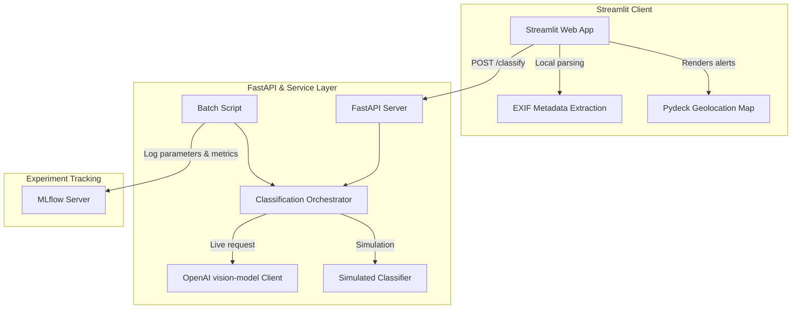

# SirenSky architecture

This document describes the high-level architecture and data flow of the SirenSky Image Garbage Classification System.

## Component overview

SirenSky is composed of three primary components:
1. **Streamlit Frontend**: An interactive web dashboard for uploading images, visualizing classifications on Pydeck maps, and reviewing alerts.
2. **FastAPI Backend Service**: A REST API providing endpoints for image classification and validation.
3. **Batch/CLI Script**: A batch processing script (`scripts/main.py`) for cataloging local image datasets.

## System architecture diagram

## Data flow
1. **Upload**: User uploads images in the Streamlit UI.
2. **Metadata extraction**: Geolocation (lat/lon) and image properties are parsed on the client side using Pillow.
3. **Classification**:
   - The UI makes calls to the FastAPI server or the local orchestrator (`classification_service.py`).
   - If `USE_SIMULATED_PREDICTIONS` is active, it runs a deterministic hash function locally.
   - Otherwise, it queries OpenAI's vision APIs using retry-resilient hooks (via `tenacity`).
4. **Alert generation**: Alerts are generated based on whether garbage was detected and whether GPS coordinates are present in the image EXIF metadata.
